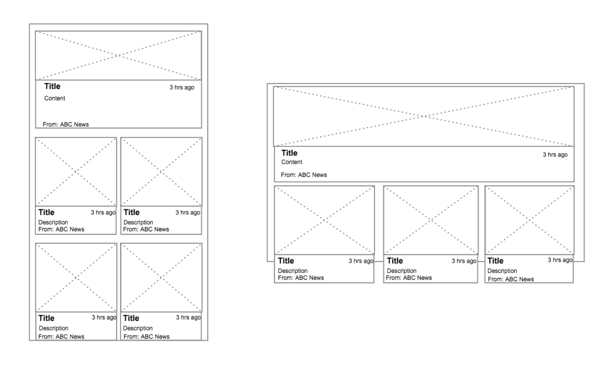

# Bonial iOS Developer Code Challenge Introduction

## Introduction

Write an application that uses the Google News Api http://newsapi.org to display the Top Headlines.
You can find documentation and how to get an api key at this url: https://newsapi.org/docs/get-started

## Design requirements
1. Display the news headlines in a grid format with 2 columns in portrait mode and with 3 columns in landscape mode.
2. Every 1st out of 7 news articles display them in full width in the grid.
### See the following example:

   
## Functionality requirements
1. On launch the app should load 21 news articles
2. Load more headlines as the user continues scrolling
3. When the user taps on a headline you should load the full article. It’s up to you how and
where to load it.

### Development requirements
1. The app should be developed in Swift
2. Your code should be production ready
3. Use a good architecture
4. You can use any 3rd party library you wish
5. If you use code from stackoverflow please comment it with the url where you found it
6. Share your solution via a zip file on dropbox or by email

### Optional tasks

1. Use a git local repository and commit code like you would on a team based project

### We’ll be scoring you based on
1. Architecture
2. Code style
3. Use of design patterns
4. Unit tests
5. Performance
